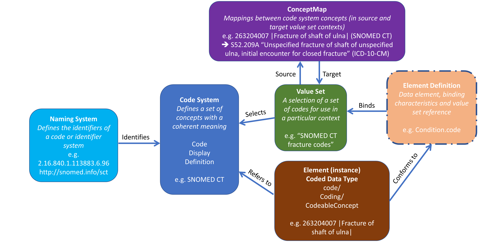

# Terminology Services

This Implementation Guide supports terminology services for validation, expansion, and lookup.

## **Terminology Server**
The terminology server used is:

- **Code Validation:** Check if a code exists in a ValueSet
- **Code Expansion:** Retrieve full lists of allowed values
- **Lookup Service:** Get details about specific codes

### **FHIR Terminology Operations**
The following FHIR terminology operations are supported:

For more details, visit [FHIR Terminology Operations](https://hl7.org/fhir/terminology-service.html).

---

## **3. Value Sets & Code Systems**
### **Value Sets**
Value Sets define allowed values for specific data elements. You can explore Value Sets in the [Value Sets Page](valuesets.html).

### **Code Systems**
Code Systems define the standard codes used in Value Sets. You can browse them in the [Code Systems Page](codesystems.html).

For terminology integration in **DHIS2**, consider exporting metadata as **FHIR CodeSystem & ValueSet**.
